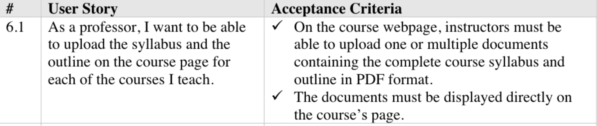
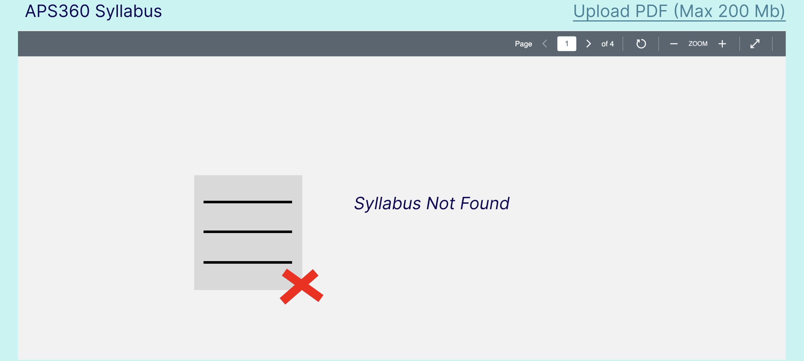
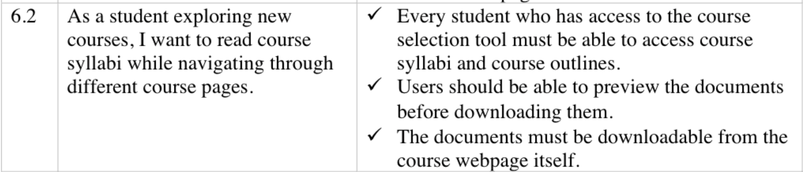
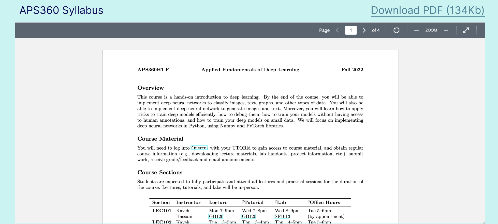

# CARTE Education Pathways

This is the repo for Samir Khaki, Ani Srikanth, and Komila Rasulova's Lab5 submission. The repo is a clone of [CARTE's in-development](https://github.com/nelaturuk/education_pathways) tool for course selection at UofT.

Description and Setup Instructions

Welcome to CARTE's in-development tool for course selection at UofT. Education Pathways allows for more intelligent course searching, by matching not just the terms you search, but ones relevant to them. The more terms you search for, the more relevant your results will be! Even try searching across disciplines for the courses that best cover each.

Whatever year you are looking for, Education Pathways will also suggest courses in earlier years that will best help you to prepare. To get the most out of this, try searching for courses in a later year and see what is suggested for your current one.

We are looking for feedback to improve Education Pathways and make it more useful for students. If you have ideas or suggestions, please email us!

## Setup Instructions

### With Docker

## Repository files:

`./Procfile ./wsgi.py` _tells gunicorn how to run the program_

`./environment.yml ./requirements.txt` _specifies python requirements for anaconda and pip respectively_

`./__init__.py` _main flask code_

`./readme.md` _this file_

`./resources:` _contains datasets used in the program_

`course_vectorizer.pickle df_processed.pickle`

`course_vectors.npz graph.pickle`

`./static:` _contains any static elements of the webpage, in this case just the CARTE logo_
`CARTE_logo.jpg`

`./templates:` _contains flask templates for rendering HTML_

`_formhelpers.html course.html index.html results.html`

### Activity 1

### Activity 2

No code has been added to the CSS file yet, so the page looks unchanged. But the .css files have been linked as seen in the second screenshot.

### Activity 3

Homepage:

Results:

### Activity 4
Homepage:

Results:

### Activity 5

### Activity 6
User Story 1.1:

User Story 6.1:

User Story 6.2:

